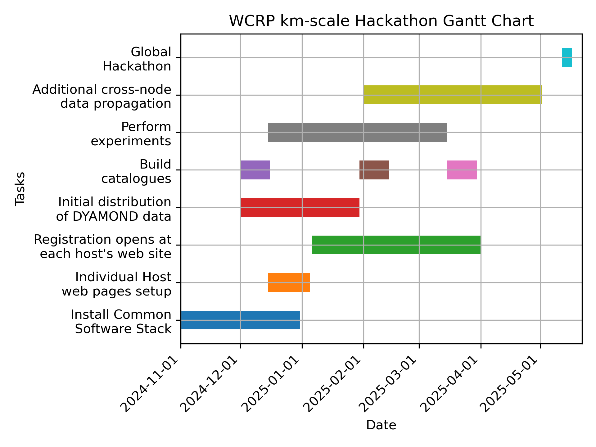

# Preparation meetings

## Meeting dates

### 18 Nov 2024

+ Coordination of websites and advertising
+ Finalizing the [data request](technical/data_request.md) (see also the Mattermost discussion of Trackers)
+ Set up a test run and assessment of one regional HEALPix conversion
  + Lukas Kluft is working on transforming an ICON regional simulation.
+ Handling of finances
  + by each node individually
  + participation fees depend on local costs and funding
  + stipends
+ Outreach activities (daily blog, videos, ...)
+ Streaming one presentation per day per node, ideally also recording it

### 19 Dec 2024

+ Sendai Protocol paper
  + published today in Progress in Earth and Planetary Science. [doi:10.1186/s40645-024-00668-1](https://doi.org/10.1186/s40645-024-00668-1)
  + a few adaptations for the hackathon need to be made, given the reality of [which simulations exist](/simulations/index.md)
+ Update on global registrations so far
+ Reports on progress with initial data processing, re-gridding etc.
+ Status update from each node:
  + Plans for mini science conferences to design node-specific objectives and actions
  + Logistics (data repositories, compute, venue)
  + Run status
  + Software stack
  + Local web sites for each node's organisation and registration

### 9  Jan 2025

### 11  Feb 2025

### 10 Mar 2025

### 15 Apr 2025

## Meeting times

8:00 to 9:30 CET and repeated at 17:00 to 18:30 CET

Each meeting will cover:

+ Steering Group topics in the first 30 minutes, and next
+ Technical Group topics.
  
### Everyone involved will receive Zoom invites with the relevant monthly links via e-mail

## A few milestones from Oct 2024 until 12 May 2025

